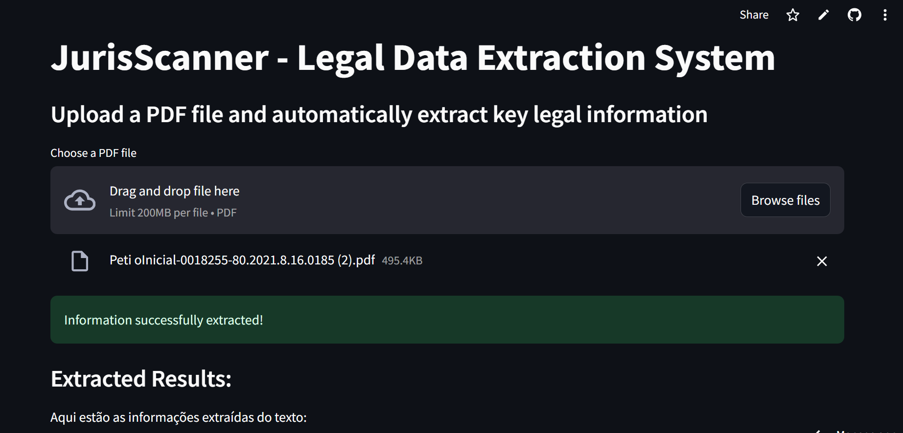

# JurisScanner

**JurisScanner** é uma aplicação inteligente desenvolvida para automatizar a extração de informações essenciais de documentos jurídicos em formato PDF. Utilizando IA generativa, o sistema analisa textos legais longos e extrai dados-chave de maneira precisa e eficiente, otimizando o trabalho de estagiários e profissionais do direito.



## Funcionalidades

- **Extração de texto de PDFs:** Converte arquivos PDF em texto legível, identificando as informações necessárias para análise jurídica.
- **Processamento com IA:** Utiliza uma API de IA para identificar e extrair dados específicos como nomes, datas, bairros, imóveis e status de processos.
- **Interface intuitiva com Streamlit:** Interface de usuário simples e acessível para fazer o upload de arquivos PDF e visualizar os resultados de forma clara.

## Tecnologias Utilizadas

- **Python**
- **Streamlit**: Framework para criação de interfaces interativas.
- **PyPDF2**: Biblioteca para leitura de arquivos PDF.
- **Google Generative AI (Gemini)**: API de IA para processar e extrair informações do texto.
- **dotenv**: Para carregar variáveis de ambiente de forma segura.

## Pré-requisitos

Antes de rodar o projeto, certifique-se de ter o Python e o pip instalados. Além disso, é necessário configurar a chave de API para a integração com o modelo de IA.

### Instalação das dependências

Clone o repositório:

```bash
git clone https://github.com/usuario/jurisscanner.git
```

Instale as dependências:

```bash
cd jurisscanner
pip install -r requirements.txt
```
Crie um arquivo .env e adicione sua chave de API:

```text
API_KEY=Sua_Chave_De_API
```
